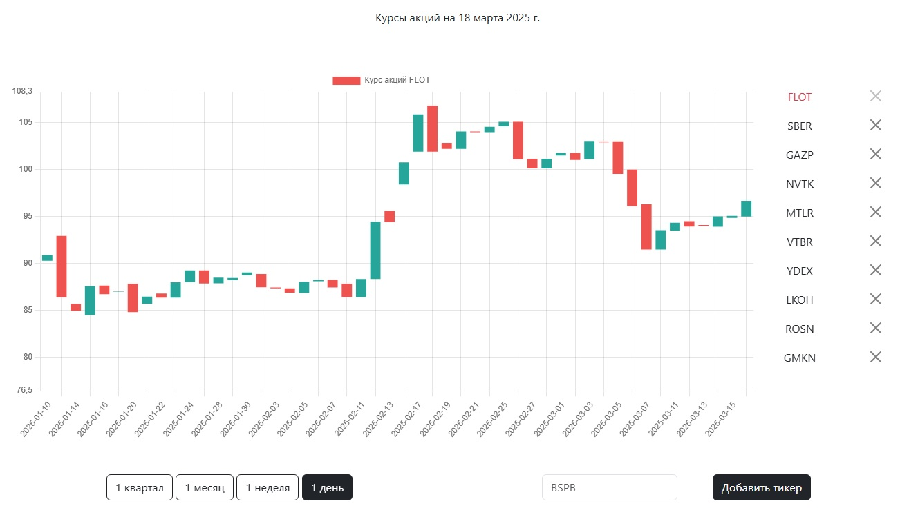

## Одностраничное приложение для работы с API Мосбиржи

Приложение получает исторические данные с сервера iss.moex.com и отображает в виде свечного графика.

### Функционал

* Загрузка данных по выбранном тикету за 100 дней.
* Выбор таймфреймов 
    - Day
    - Week
    - Month
    - Quarter
* Подгруженные данные сохраняются в localstorage для увеличения скорости работы и оптимизации нагрузки на сервер. 
* График позоляет делать масштабирование и промотку.
* Реализован режим lazyLoad, данные подгружаются по мере пролистывания графика.
* Представлен набор избранных тикетов, с которыми может работать пользователь, быстро переключаясь между ними. Тикеты можно добавлять, удалять. Список сохраняется в localstorage.

Примечание. Функция saveFile в модуле models + закомментированные строки 40-41 в этом же модуле позволяет сохранять загруженные данные в виде файла. К веб-интерфейсу не привязана, подключайте сами :)
 
### Технологии и ресурсы

* Проект реализован на нативном JavaScript.
* Применён модульный принцип, сборка webpack.
* Библиотеки
    - chart.js
    - chartjs-plugin-zoom

### Пример запроса API MOEX

iss.moex.com/iss/engines/stock/markets/shares/boards/TQBR/securities/SBER/candles.json?interval=60&from=2025-02-27

* markets/shares - рынок акций.
* boards/TQBR - режим торгов TQBR.
* securities/SBER - обыкновенные акции Сбербанка.
* candles.json - данные по свечам в формате JSON.
* interval – Размер свечки - целое число 1 (1 минута), 10 (10 минут), 60 (1 час), 24 (1 день), 7 (1 неделя), 31 (1 месяц) или 4 (1 квартал). По умолчанию дневные данные.
* from - стартовый период, за который будут представлены данные.
    
Подробнее с документацией можно ознакомиться здесь - https://wlm1ke.github.io/apimoex/build/html/api.html

